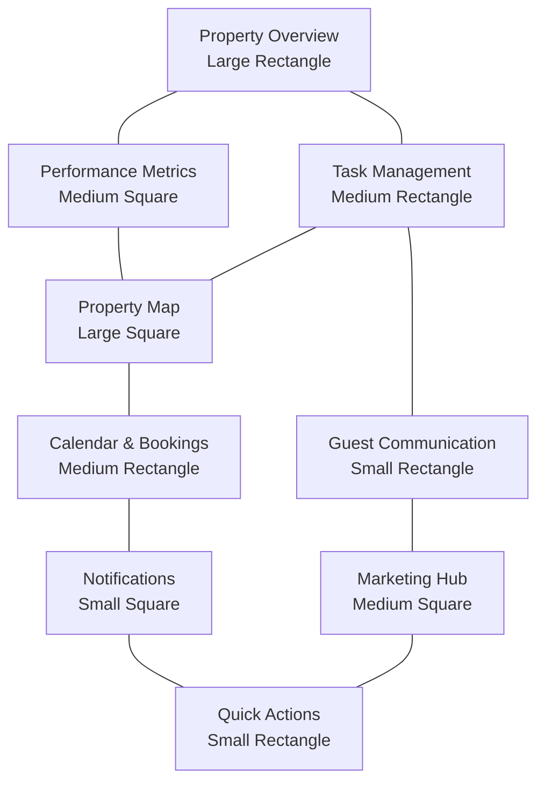
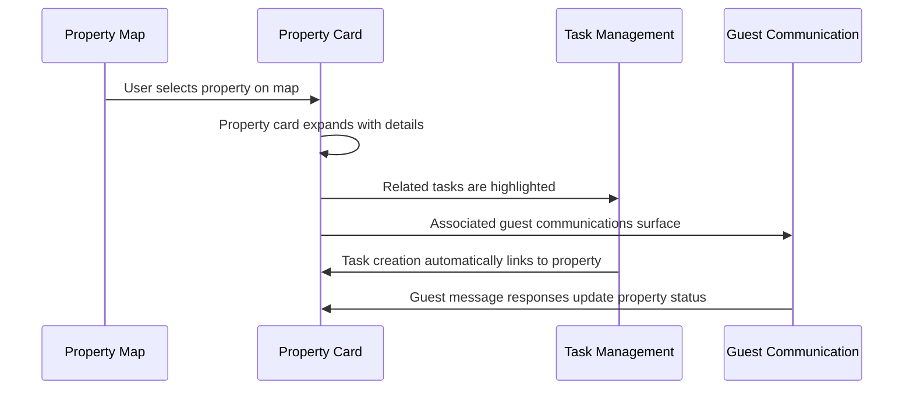
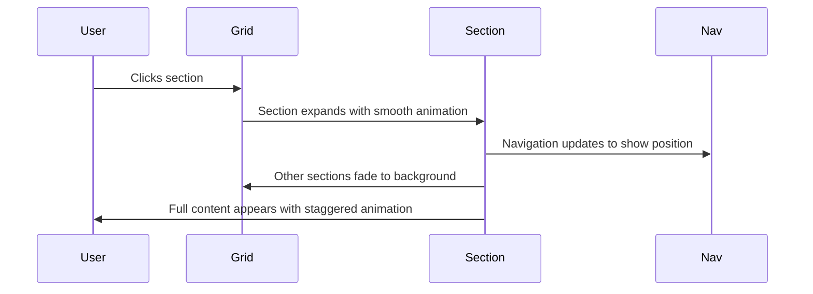
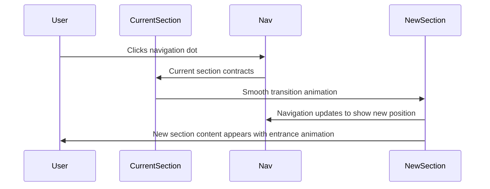
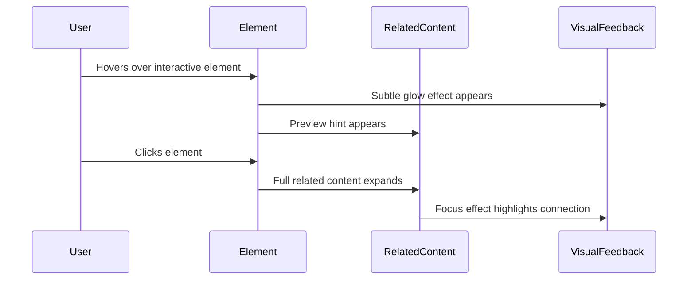

# HostScale Bento Dashboard Concept

## Overview

The HostScale dashboard reimagined as a bento grid layout creates a fresh, modern approach to property management. This innovative dashboard fits entirely within the viewport without scrolling, offering immediate access to all critical information through an elegant array of interconnected panels with varying sizes and proportions.

## Bento Grid Layout

The dashboard is organized into nine asymmetrical sections arranged in a visually balanced grid, creating distinct functional areas while maintaining a cohesive user experience.

## Visual Design Elements

### Dark Theme Glassmorphism
- **Base Background**: Deep blue-purple gradient with subtle animation
- **Panel Materials**: Varying levels of glassmorphism with different blur intensities
- **Accent Colors**: Teal (#00CFFD) for primary elements, gold (#FFC107) for alerts
- **Status Indicators**: Green (active), amber (attention), red (urgent), blue (info)
- **Depth Effects**: Multi-layered panels with subtle elevation differences

### Typography & Iconography
- **Typeface**: Clean, modern sans-serif (Manrope for headings, Inter for body text)
- **Text Hierarchy**: Clear size and weight distinction between levels
- **Icons**: Custom line icon system with consistent stroke width
- **Badges**: Minimal circular indicators for counts and status

## Interactive Elements

### Panel Interactions
- **Hover Effects**: Subtle elevation change with increased brightness
- **Expansion**: Panels expand to full screen when clicked for detailed view
- **Quick Preview**: Information tooltip on extended hover
- **Focus States**: Clear indication of keyboard focus for accessibility

### Data Visualization Enhancements
- **Animated Charts**: Data visualizations that animate on appearance
- **Interactive Graphs**: Hover states reveal detailed data points
- **Comparison Toggles**: Before/after or filtered view comparisons
- **Real-time Updates**: Subtle pulse effects for new data arrivals

### Navigation System
- **Floating Navigation Pill**: Horizontal pill-shaped menu
- **Context-Awareness**: Navigation adapts based on current focus
- **Section Indicators**: Subtle dots showing current position
- **Quick Return**: One-click return to full grid view

## Section Details

### 1. Property Overview (Large Rectangle)

#### Default State (Grid View)
- Property portfolio summary with key statistics
- Filter controls for property type, location, status
- Visual occupancy timeline for next 30 days
- Quick-access property cards with status indicators

#### Expanded State
- Comprehensive property list with detailed metrics
- Advanced filtering and sorting options
- Property comparison tools
- Bulk action capabilities for multiple properties

#### Visual Elements
- Status-coded property cards with thumbnail images
- Occupancy heatmap showing booking density
- Performance sparklines for each property
- Priority indicators for properties needing attention

### 2. Performance Metrics (Medium Square)

#### Default State (Grid View)
- Four key metric cards (Occupancy, Revenue, Satisfaction, Tasks)
- Period-over-period change indicators
- Mini trend graphs showing historical patterns
- Current period progress indicators

#### Expanded State
- Detailed metric breakdown with multiple dimensions
- Customizable date ranges and comparison periods
- Drill-down capabilities by property or segment
- Goal tracking and forecasting tools

#### Visual Elements
- Radial progress indicators for KPI completion
- Animated trend lines with gradient fills
- Comparison indicators with directional arrows
- Pulsing effects for metrics exceeding thresholds

### 3. Task Management (Medium Rectangle)

#### Default State (Grid View)
- Priority-sorted task list with status indicators
- Task grouping by type (maintenance, cleaning, etc.)
- Due date visualization with urgency indicators
- Assignment status for team distribution

#### Expanded State
- Comprehensive task management system
- Drag-and-drop priority adjustment
- Team workload visualization
- Task creation and editing interface

#### Visual Elements
- Priority-coded task cards with status indicators
- Timeline visualization for due dates
- Team avatar clusters showing assignments
- Progress indicators for multi-step tasks

### 4. Property Map (Large Square)

#### Default State (Grid View)
- Geographic visualization of property locations
- Clustering for high-density areas
- Status indicators overlaid on map
- Heat map toggle for performance visualization

#### Expanded State
- Full-screen interactive map experience
- Detailed property information on selection
- Route planning and optimization tools
- Multiple data overlay options (performance, pricing, etc.)

#### Visual Elements
- Custom map styling matching dashboard theme
- Animated location markers with status indicators
- Performance heat maps with gradient overlays
- Clustering visualization for property groups

### 5. Guest Communication (Small Rectangle)

#### Default State (Grid View)
- Recent message preview with status
- Message categorization (inquiry, support, etc.)
- Response time indicators
- AI-handled vs. manual response indicators

#### Expanded State
- Full conversation history with contextual information
- AI suggestion panel for response assistance
- Template library for quick responses
- Guest profile with stay history and preferences

#### Visual Elements
- Message cards with timestamp and status
- AI badge for automated responses
- Response time indicators with urgency colors
- Typing indicators for real-time communication

### 6. Calendar & Bookings (Medium Rectangle)

#### Default State (Grid View)
- Visual booking timeline for next 14 days
- Check-in/check-out clustering for resource planning
- Booking status indicators (confirmed, pending, etc.)
- Special requirements highlighting

#### Expanded State
- Full calendar view with multiple visualization options
- Booking management interface
- Availability management and optimization tools
- Seasonal pricing visualization and adjustment tools

#### Visual Elements
- Color-coded booking blocks on timeline
- Check-in/out icons with guest count indicators
- Special request badges on bookings
- Pricing heat map overlays for rate optimization

### 7. Marketing Hub (Medium Square)

#### Default State (Grid View)
- Channel performance summary
- Recent UGC preview with engagement stats
- Remarketing campaign status indicators
- CPA trend visualization across channels

#### Expanded State
- Comprehensive marketing performance dashboard
- Campaign management interface
- UGC library and rights management
- Detailed channel attribution analysis

#### Visual Elements
- Channel contribution visualization
- UGC gallery with performance indicators
- Campaign status cards with performance metrics
- ROI comparison charts for marketing activities

### 8. Notifications (Small Square)

#### Default State (Grid View)
- Priority-sorted notification center
- Categorized alerts (guest, maintenance, system)
- Action requirement indicators
- Timestamp with elapsed time visualization

#### Expanded State
- Complete notification history with filtering
- Notification preference management
- Bulk action capabilities for similar notifications
- Setting adjustment suggestions based on patterns

#### Visual Elements
- Notification cards with priority indicators
- Pulsing effect for new notifications
- Category icons for quick recognition
- Time elapsed visualization for urgent items

### 9. Quick Actions (Small Rectangle)

#### Default State (Grid View)
- Most frequent action buttons
- Recently used action shortcuts
- Context-aware suggested actions
- AI assistant access point

#### Expanded State
- Complete action library organized by category
- Custom action creation interface
- Automation recipe builder
- Command palette for keyboard power users

#### Visual Elements
- Action buttons with subtle hover animations
- Context-aware suggestion highlights
- Recently used action history
- AI assistant animation for intelligent suggestions

## Advanced Interactions

### Multi-Panel Orchestration
- **Related Data Highlighting**: Hovering over an element highlights related information across panels
- **Contextual Expansion**: Clicking an element in one panel can expand a related panel
- **Focus Mode**: Option to temporarily maximize attention on one or two panels
- **Notification Ripples**: Visual effects that flow between panels to show data relationships

### AI-Enhanced Interactions
- **Predictive Suggestions**: AI surfaces relevant actions based on current context
- **Attention Guiding**: Subtle visual cues direct attention to areas needing focus
- **Pattern Recognition**: Visual highlighting of unusual patterns or opportunities
- **Natural Language Commands**: Search bar doubles as command interface with suggestions

### Cross-Panel Workflows

## Responsive Adaptations

### Viewport Adjustments
- **Aspect Ratio Maintenance**: Grid maintains proportions while scaling
- **Content Density**: Automatic adjustment of information density based on screen size
- **Touch Optimization**: Larger hit areas and modified interactions for touch devices
- **Split View Support**: Optimized layout for split-screen multitasking

### Panel Priority System
- **Essential Panels**: Critical panels remain visible even on smaller screens
- **Collapsible Content**: Less critical information collapses progressively
- **Priority Stacking**: Panels rearrange based on contextual priority
- **Focused States**: Option to temporarily maximize specific panels

## Animation Concepts

### Micro-Animations
- **Hover Feedback**: Subtle elevation and brightness changes
- **Status Transitions**: Smooth animations between states
- **Data Updates**: Gentle transitions for changing values
- **Loading States**: Elegant placeholder animations during data fetching

### Transition Effects
- **Panel Expansion**: Smooth animation from grid to full view
- **Data Filtering**: Animated transitions when applying filters
- **View Switching**: Fluid motion between different visualizations
- **Return Animation**: Graceful contraction when returning to grid

### Ambient Motion
- **Background Subtle**: Very slight movement in background gradient
- **Idle State Breathing**: Subtle rhythmic animation in inactive state
- **Attention Pulses**: Gentle pulses for items requiring attention
- **Data Flow Visualization**: Abstract representation of system activity

## Implementation Strategy

While avoiding code specifics, the implementation would leverage:
- CSS Grid and Flexbox for responsive layout
- GPU-accelerated transitions for smooth animations
- Canvas or WebGL for data visualizations and effects
- Intersection and Resize Observer APIs for responsive behavior
- Modern CSS features including backdrop-filter for glassmorphism

---

This bento grid dashboard concept reimagines property management with a fresh, modern approach that balances aesthetic appeal with functional excellence. By presenting all critical information within a single viewport through an elegant array of interconnected panels, HostScale delivers an intuitive, efficient user experience that scales seamlessly from dozens to hundreds of properties.

# HostScale Bento Dashboard Concept

## Overview

The HostScale dashboard reimagined as a bento grid layout creates a fresh, modern approach to property management. This innovative dashboard fits entirely within the viewport without scrolling, offering immediate access to all critical information through an elegant array of interconnected panels with varying sizes and proportions.

## Bento Grid Layout

The dashboard is organized into nine asymmetrical sections arranged in a visually balanced grid, creating distinct functional areas while maintaining a cohesive user experience.

## Visual Design Elements

### Dark Theme Glassmorphism
- **Base Background**: Deep blue-purple gradient with subtle animation
- **Panel Materials**: Varying levels of glassmorphism with different blur intensities
- **Accent Colors**: Teal (#00CFFD) for primary elements, gold (#FFC107) for alerts
- **Status Indicators**: Green (active), amber (attention), red (urgent), blue (info)
- **Depth Effects**: Multi-layered panels with subtle elevation differences

### Typography & Iconography
- **Typeface**: Clean, modern sans-serif (Manrope for headings, Inter for body text)
- **Text Hierarchy**: Clear size and weight distinction between levels
- **Icons**: Custom line icon system with consistent stroke width
- **Badges**: Minimal circular indicators for counts and status

## Interactive Elements

### Panel Interactions
- **Hover Effects**: Subtle elevation change with increased brightness
- **Expansion**: Panels expand to full screen when clicked for detailed view
- **Quick Preview**: Information tooltip on extended hover
- **Focus States**: Clear indication of keyboard focus for accessibility

### Data Visualization Enhancements
- **Animated Charts**: Data visualizations that animate on appearance
- **Interactive Graphs**: Hover states reveal detailed data points
- **Comparison Toggles**: Before/after or filtered view comparisons
- **Real-time Updates**: Subtle pulse effects for new data arrivals

### Navigation System
- **Floating Navigation Pill**: Horizontal pill-shaped menu
- **Context-Awareness**: Navigation adapts based on current focus
- **Section Indicators**: Subtle dots showing current position
- **Quick Return**: One-click return to full grid view

## Section Details

### 1. Property Overview (Large Rectangle)

#### Default State (Grid View)
- Property portfolio summary with key statistics
- Filter controls for property type, location, status
- Visual occupancy timeline for next 30 days
- Quick-access property cards with status indicators

#### Expanded State
- Comprehensive property list with detailed metrics
- Advanced filtering and sorting options
- Property comparison tools
- Bulk action capabilities for multiple properties

#### Visual Elements
- Status-coded property cards with thumbnail images
- Occupancy heatmap showing booking density
- Performance sparklines for each property
- Priority indicators for properties needing attention

### 2. Performance Metrics (Medium Square)

#### Default State (Grid View)
- Four key metric cards (Occupancy, Revenue, Satisfaction, Tasks)
- Period-over-period change indicators
- Mini trend graphs showing historical patterns
- Current period progress indicators

#### Expanded State
- Detailed metric breakdown with multiple dimensions
- Customizable date ranges and comparison periods
- Drill-down capabilities by property or segment
- Goal tracking and forecasting tools

#### Visual Elements
- Radial progress indicators for KPI completion
- Animated trend lines with gradient fills
- Comparison indicators with directional arrows
- Pulsing effects for metrics exceeding thresholds

### 3. Task Management (Medium Rectangle)

#### Default State (Grid View)
- Priority-sorted task list with status indicators
- Task grouping by type (maintenance, cleaning, etc.)
- Due date visualization with urgency indicators
- Assignment status for team distribution

#### Expanded State
- Comprehensive task management system
- Drag-and-drop priority adjustment
- Team workload visualization
- Task creation and editing interface

#### Visual Elements
- Priority-coded task cards with status indicators
- Timeline visualization for due dates
- Team avatar clusters showing assignments
- Progress indicators for multi-step tasks

### 4. Property Map (Large Square)

#### Default State (Grid View)
- Geographic visualization of property locations
- Clustering for high-density areas
- Status indicators overlaid on map
- Heat map toggle for performance visualization

#### Expanded State
- Full-screen interactive map experience
- Detailed property information on selection
- Route planning and optimization tools
- Multiple data overlay options (performance, pricing, etc.)

#### Visual Elements
- Custom map styling matching dashboard theme
- Animated location markers with status indicators
- Performance heat maps with gradient overlays
- Clustering visualization for property groups

### 5. Guest Communication (Small Rectangle)

#### Default State (Grid View)
- Recent message preview with status
- Message categorization (inquiry, support, etc.)
- Response time indicators
- AI-handled vs. manual response indicators

#### Expanded State
- Full conversation history with contextual information
- AI suggestion panel for response assistance
- Template library for quick responses
- Guest profile with stay history and preferences

#### Visual Elements
- Message cards with timestamp and status
- AI badge for automated responses
- Response time indicators with urgency colors
- Typing indicators for real-time communication

### 6. Calendar & Bookings (Medium Rectangle)

#### Default State (Grid View)
- Visual booking timeline for next 14 days
- Check-in/check-out clustering for resource planning
- Booking status indicators (confirmed, pending, etc.)
- Special requirements highlighting

#### Expanded State
- Full calendar view with multiple visualization options
- Booking management interface
- Availability management and optimization tools
- Seasonal pricing visualization and adjustment tools

#### Visual Elements
- Color-coded booking blocks on timeline
- Check-in/out icons with guest count indicators
- Special request badges on bookings
- Pricing heat map overlays for rate optimization

### 7. Marketing Hub (Medium Square)

#### Default State (Grid View)
- Channel performance summary
- Recent UGC preview with engagement stats
- Remarketing campaign status indicators
- CPA trend visualization across channels

#### Expanded State
- Comprehensive marketing performance dashboard
- Campaign management interface
- UGC library and rights management
- Detailed channel attribution analysis

#### Visual Elements
- Channel contribution visualization
- UGC gallery with performance indicators
- Campaign status cards with performance metrics
- ROI comparison charts for marketing activities

### 8. Notifications (Small Square)

#### Default State (Grid View)
- Priority-sorted notification center
- Categorized alerts (guest, maintenance, system)
- Action requirement indicators
- Timestamp with elapsed time visualization

#### Expanded State
- Complete notification history with filtering
- Notification preference management
- Bulk action capabilities for similar notifications
- Setting adjustment suggestions based on patterns

#### Visual Elements
- Notification cards with priority indicators
- Pulsing effect for new notifications
- Category icons for quick recognition
- Time elapsed visualization for urgent items

### 9. Quick Actions (Small Rectangle)

#### Default State (Grid View)
- Most frequent action buttons
- Recently used action shortcuts
- Context-aware suggested actions
- AI assistant access point

#### Expanded State
- Complete action library organized by category
- Custom action creation interface
- Automation recipe builder
- Command palette for keyboard power users

#### Visual Elements
- Action buttons with subtle hover animations
- Context-aware suggestion highlights
- Recently used action history
- AI assistant animation for intelligent suggestions

## Advanced Interactions

### Multi-Panel Orchestration
- **Related Data Highlighting**: Hovering over an element highlights related information across panels
- **Contextual Expansion**: Clicking an element in one panel can expand a related panel
- **Focus Mode**: Option to temporarily maximize attention on one or two panels
- **Notification Ripples**: Visual effects that flow between panels to show data relationships

### AI-Enhanced Interactions
- **Predictive Suggestions**: AI surfaces relevant actions based on current context
- **Attention Guiding**: Subtle visual cues direct attention to areas needing focus
- **Pattern Recognition**: Visual highlighting of unusual patterns or opportunities
- **Natural Language Commands**: Search bar doubles as command interface with suggestions

### Cross-Panel Workflows

## Responsive Adaptations

### Viewport Adjustments
- **Aspect Ratio Maintenance**: Grid maintains proportions while scaling
- **Content Density**: Automatic adjustment of information density based on screen size
- **Touch Optimization**: Larger hit areas and modified interactions for touch devices
- **Split View Support**: Optimized layout for split-screen multitasking

### Panel Priority System
- **Essential Panels**: Critical panels remain visible even on smaller screens
- **Collapsible Content**: Less critical information collapses progressively
- **Priority Stacking**: Panels rearrange based on contextual priority
- **Focused States**: Option to temporarily maximize specific panels

## Animation Concepts

### Micro-Animations
- **Hover Feedback**: Subtle elevation and brightness changes
- **Status Transitions**: Smooth animations between states
- **Data Updates**: Gentle transitions for changing values
- **Loading States**: Elegant placeholder animations during data fetching

### Transition Effects
- **Panel Expansion**: Smooth animation from grid to full view
- **Data Filtering**: Animated transitions when applying filters
- **View Switching**: Fluid motion between different visualizations
- **Return Animation**: Graceful contraction when returning to grid

### Ambient Motion
- **Background Subtle**: Very slight movement in background gradient
- **Idle State Breathing**: Subtle rhythmic animation in inactive state
- **Attention Pulses**: Gentle pulses for items requiring attention
- **Data Flow Visualization**: Abstract representation of system activity

## Implementation Strategy

While avoiding code specifics, the implementation would leverage:
- CSS Grid and Flexbox for responsive layout
- GPU-accelerated transitions for smooth animations
- Canvas or WebGL for data visualizations and effects
- Intersection and Resize Observer APIs for responsive behavior
- Modern CSS features including backdrop-filter for glassmorphism

---

This bento grid dashboard concept reimagines property management with a fresh, modern approach that balances aesthetic appeal with functional excellence. By presenting all critical information within a single viewport through an elegant array of interconnected panels, HostScale delivers an intuitive, efficient user experience that scales seamlessly from dozens to hundreds of properties.

# HostScale Bento Grid Section Details

## Overview

The HostScale proposal is presented through nine distinct bento grid sections, each functioning both as a standalone informational component in the grid view and as an expandable full-content experience. This document details each section's content, visual design, and interactive elements.

## Navigation System

A floating navigation pill remains accessible throughout the experience, providing:

- **Section Dots**: Nine illuminated dots representing each section
- **Current Position**: Active section highlighted with glow effect
- **Quick Navigation**: Click functionality to jump between sections
- **Section Labels**: Text labels appear on hover for clarity
- **Return Function**: Quick return to grid view from any expanded section

```mermaid
graph LR
    A((1)) --- B((2)) --- C((3)) --- D((4)) --- E((5)) --- F((6)) --- G((7)) --- H((8)) --- I((9))
    
    style A fill:#00CFFD,stroke:#FFFFFF,stroke-width:2px
    style B fill:#1A1A2E,stroke:#FFFFFF,stroke-width:1px
    style C fill:#1A1A2E,stroke:#FFFFFF,stroke-width:1px
    style D fill:#1A1A2E,stroke:#FFFFFF,stroke-width:1px
    style E fill:#1A1A2E,stroke:#FFFFFF,stroke-width:1px
    style F fill:#1A1A2E,stroke:#FFFFFF,stroke-width:1px
    style G fill:#1A1A2E,stroke:#FFFFFF,stroke-width:1px
    style H fill:#1A1A2E,stroke:#FFFFFF,stroke-width:1px
    style I fill:#1A1A2E,stroke:#FFFFFF,stroke-width:1px
```

## Section 1: Hero & Product Introduction

### Grid View (Large Rectangle)
- **Visual Elements**: HostScale logo with dynamic particle effects radiating outward
- **Content**: Bold headline "Scale Your Property Empire" with supporting tagline
- **Animation**: Subtle particle animation representing connected properties
- **Interactive Element**: Pulsing "Explore" indicator

### Expanded View
- **Header**: Dynamic welcome message with client name
- **Introduction**: Concise overview of the HostScale platform
- **Key Value Props**: Three animated cards highlighting core benefits:
  * Operational Efficiency (40% time savings)
  * Revenue Optimization (15% revenue increase)
  * Scaling Capability (2.5x growth without proportional staff increase)
- **Visual Element**: Abstract 3D visualization of property network transformation
- **Interactive Element**: Animated statistic counters showing key metrics

### Visual Design
- **Primary Color**: Deep blue background with teal accents
- **Animation**: Flowing particles that respond to mouse movement
- **Typography**: Large, confident heading with crisp subtext
- **Depth**: Multiple layers creating dimensional effect

## Section 2: Problem Visualization

### Grid View (Medium Square)
- **Visual Elements**: Abstract representation of disconnected systems
- **Content**: "From Chaos to Control" headline with problem indicator
- **Animation**: Fragmented elements with disconnected movement
- **Interactive Element**: Pulsing pain points

### Expanded View
- **Problem Statement**: Clear articulation of current challenges
- **Pain Point Visualization**: Interactive diagram showing:
  * Multiple Airbnb accounts creating fragmentation
  * Repetitive guest inquiries consuming time
  * Quality control challenges across properties
  * Manual coordination creating inefficiencies
- **Cost Calculator**: Interactive tool estimating current inefficiency costs
- **Testimonial**: Quote from property manager describing similar challenges
- **Transition Element**: Visual bridge to solution (next section)

### Visual Design
- **Color Scheme**: Darker elements representing problems with amber warning accents
- **Animation**: Disconnected movements showing fragmentation
- **Visual Metaphor**: Islands of information without bridges
- **Interactive Elements**: Clickable pain points that expand with details

## Section 3: Solution Overview

### Grid View (Medium Rectangle)
- **Visual Elements**: Unified hub with connected spokes
- **Content**: "One Platform, Complete Control" headline
- **Animation**: Flowing data streams between components
- **Interactive Element**: Pulsing hub center

### Expanded View
- **Central Intelligence Hub**: Core platform visualization with:
  * Property database at center
  * Connected systems radiating outward
  * Data flow visualization showing information movement
- **Four Key Components**: Expandable cards detailing:
  * AI-Powered Guest Experience
  * Operational Workflow Engine
  * Portfolio Scaling Tools
  * Marketing Performance Hub
- **Integration Visualization**: Connected platforms diagram
- **Transition Element**: Before/after comparison slider

### Visual Design
- **Color Scheme**: Teal accents representing solution with unified blue background
- **Animation**: Smooth, connected data flows between components
- **Visual Metaphor**: Central hub unifying previously disconnected elements
- **Interactive Elements**: Clickable components with expansion animations

## Section 4: Dashboard Experience

### Grid View (Large Square)
- **Visual Elements**: Stylized dashboard preview with glass effect cards
- **Content**: "Your Command Center" headline with feature indicators
- **Animation**: Subtle data updates across dashboard elements
- **Interactive Element**: Pulsing action points

### Expanded View
- **Interactive Dashboard Demo**: Functional prototype showcasing:
  * Property management grid with status indicators
  * Performance metrics with animated charts
  * Task management system with priority visualization
  * Guest communication center with AI assistance
  * Marketing performance analytics
- **Feature Exploration**: Interactive tour highlighting key capabilities
- **Personalization Options**: Preview of customization possibilities
- **User Role Views**: Toggle between different user perspective

### Visual Design
- **Color Scheme**: Dark theme with glassmorphism panels
- **Animation**: Realistic UI interactions and data updates
- **Visual Style**: Modern, clean interface with clear information hierarchy
- **Interactive Elements**: Functional dashboard components demonstrating real features

## Section 5: Property Checklist System

### Grid View (Small Rectangle)
- **Visual Elements**: Circular arrangement of 16 category icons
- **Content**: "Complete Property Knowledge" headline
- **Animation**: Rotating highlight effect across categories
- **Interactive Element**: Pulsing completion indicator

### Expanded View
- **Category Visualization**: Interactive radial display of all 16 property checklist categories
- **Data Structure**: Expandable view of checklist architecture
- **Sample Property**: Explore an actual property's complete checklist
- **Integration Points**: Visualization showing how checklist powers other systems:
  * AI responses drawing from property details
  * Task generation based on checklist items
  * Quality verification using checklist standards
  * Marketing utilizing property features
- **Implementation Process**: Step-by-step visualization of setup process

### Visual Design
- **Color Scheme**: Categorical color coding within unified theme
- **Animation**: Smooth expansion of categories on interaction
- **Visual Metaphor**: Complete knowledge circle surrounding property core
- **Interactive Elements**: Expandable categories revealing detailed items

## Section 6: Implementation Options

### Grid View (Medium Rectangle)
- **Visual Elements**: Split-panel comparison visualization
- **Content**: "Flexible Implementation" headline with option indicators
- **Animation**: Alternating highlight between options
- **Interactive Element**: Toggle switch between approaches

### Expanded View
- **Option Comparison**: Side-by-side visualization of:
  * Monthly Partnership (Strategic Solution)
  * Standalone Dashboard (One-Time Implementation)
- **Feature Matrix**: Interactive comparison of included capabilities
- **Timeline Visualization**: Implementation phases for each approach:
  * Discovery & Foundation
  * Core Features Development
  * Training & Optimization
  * Ongoing Support (Partnership model)
- **Investment Calculator**: ROI projection based on property count and option selected
- **Client Preference Selector**: Interactive tool to indicate preferences

### Visual Design
- **Color Scheme**: Dual-tone design distinguishing options
- **Animation**: Smooth transitions between option details
- **Visual Style**: Clean comparison with clear differentiation
- **Interactive Elements**: Option toggle with dynamic content updates

## Section 7: Marketing Performance Hub

### Grid View (Medium Square)
- **Visual Elements**: Channel performance visualization with UGC samples
- **Content**: "Growth Engine" headline with performance indicators
- **Animation**: Flowing conversions between channels
- **Interactive Element**: Pulsing optimization points

### Expanded View
- **Marketing Automation**: Visualization of guest journey automation
- **UGC Generation System**: Gallery showcase with rights management
- **Remarketing Platform**: Audience building and campaign visualization
- **Referral Network**: Partnership and commission tracking interface
- **CPA Optimization**: Interactive demonstration of cost reduction potential
- **Channel Performance**: Analytics visualization across booking platforms
- **ROI Calculator**: Interactive tool showing marketing performance improvements

### Visual Design
- **Color Scheme**: Marketing-focused palette with conversion highlights
- **Animation**: Data flow visualizations showing guest journey
- **Visual Style**: Analytics-rich interface with clear metrics
- **Interactive Elements**: Adjustable parameters showing marketing impact

## Section 8: Expected Outcomes

### Grid View (Small Square)
- **Visual Elements**: Multi-metric improvement visualization
- **Content**: "Transformative Results" headline with key stats
- **Animation**: Growing metric indicators
- **Interactive Element**: Pulsing comparison toggle

### Expanded View
- **Operational Improvements**: Visual comparison showing:
  * 40% reduction in routine tasks
  * 50% faster guest response times
  * 75% faster property onboarding
  * 30% reduction in maintenance issues
- **Financial Impact**: ROI visualization with:
  * 15% booking revenue increase
  * 25% reduced acquisition costs
  * 20% increase in direct bookings
  * New revenue streams from partnerships
- **Scaling Visualization**: Interactive demonstration of growth capacity
- **Timeline Slider**: Progressive improvements over implementation phases
- **Client-Specific Projections**: Customized estimates based on property portfolio

### Visual Design
- **Color Scheme**: Success-oriented colors with growth indicators
- **Animation**: Rising metrics with celebration effects
- **Visual Style**: Clear before/after comparisons with data visualization
- **Interactive Elements**: Timeline slider showing progressive improvements

## Section 9: Next Steps & Call to Action

### Grid View (Small Rectangle)
- **Visual Elements**: Path visualization leading to implementation
- **Content**: "Begin Your Transformation" headline
- **Animation**: Pulsing path with directional flow
- **Interactive Element**: Glowing CTA button

### Expanded View
- **Discovery Workshop**: Interactive scheduling interface for booking the initial session
- **Implementation Preview**: Visual roadmap of next steps
- **Beta Program Benefits**: Highlighted advantages for early adopters:
  * Preferred pricing
  * Priority feature development
  * Dedicated implementation support
- **Contact Options**: Multiple ways to reach out
- **Quick Response Form**: Simplified inquiry submission
- **FAQ Section**: Expandable answers to common questions
- **Implementation Timeline**: Visual calendar of key milestones

### Visual Design
- **Color Scheme**: Action-oriented with clear directional elements
- **Animation**: Path completion visualization showing journey
- **Visual Style**: Forward-looking with momentum indicators
- **Interactive Elements**: Calendar scheduling and form submission

## Transitions & Interactions

### Grid to Section Expansion

### Section Navigation

### Interactive Element Behavior

## Visual Effects System

### Glassmorphism Implementation
- **Base Effect**: Semi-transparent panels with backdrop blur
- **Depth Variations**: Different blur intensities for hierarchy
- **Edge Treatment**: Subtle light borders on top/left edges
- **Shadow Effects**: Soft shadows for elevation indication
- **Hover Enhancement**: Increased transparency and glow on interaction

### Animation Principles
- **Purpose-Driven**: All animations serve communication purpose
- **Timing Curves**: Custom easing functions for natural movement
- **Duration Guidelines**: 300-500ms for major transitions, 150-200ms for micro-interactions
- **Staggered Reveals**: Content elements appear in sequence rather than simultaneously
- **Spatial Continuity**: Elements maintain spatial relationships during transitions

### Lighting System
- **Ambient Illumination**: Subtle overall lighting effect
- **Focus Lighting**: Increased brightness for active elements
- **Directional Highlights**: Light reflections responding to interaction
- **State Indication**: Different lighting for various states (default, hover, active)
- **Attention Guidance**: Light leading user attention to important elements

---

This detailed breakdown of the nine bento grid sections provides a comprehensive plan for creating an engaging, interactive proposal experience. Each section functions both as a standalone component within the grid view and as an expandable full-content experience, all navigable through the persistent pill interface.