# HostScale: Scale Your Property Empire

## From 60+ to 150+ Properties Without the Chaos

*A transformative property management platform built for scale, efficiency, and exceptional guest experiences.*

---

## The Challenge

Managing multiple short-term rental properties across different platforms creates exponential complexity:

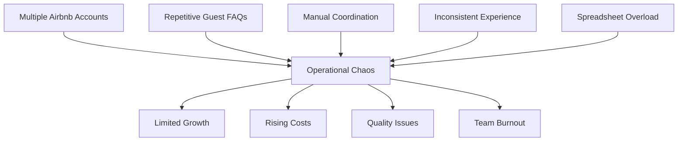

As your portfolio grows from 60+ to 150+ properties, these challenges don't just increase—they multiply.

---

## The Solution: HostScale

HostScale unifies your entire operation with an AI-powered central intelligence system that scales effortlessly with your business.

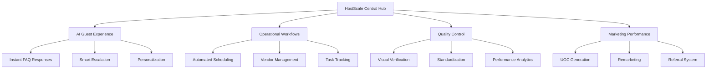

---

## Key Benefits

### Operational Transformation

- **40% reduction** in time spent on routine management tasks
- **50% faster** response times to guest inquiries 
- **30% decrease** in maintenance issues through proactive management
- **Single dashboard** for all properties across all platforms

### Revenue Optimization

- **15% increase** in overall booking revenue through optimized pricing
- **25% reduction** in customer acquisition costs
- **20% boost** in direct bookings
- **New revenue streams** from local partnerships and referrals

### Scaling Capability

- **2.5x portfolio growth** without proportional staff increases
- **75% faster** new property onboarding
- **Consistent quality** maintenance across all properties
- **Team efficiency** that improves with scale rather than deteriorates

---

## Intelligent Property Database

At the core of HostScale is a comprehensive property information system with 16 detailed categories:

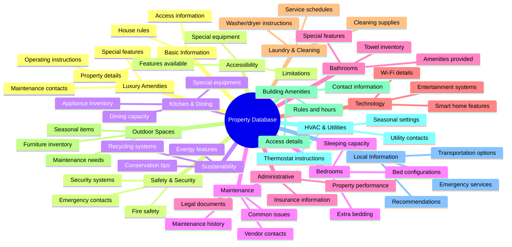

This structured data powers everything from AI responses to operational workflows, ensuring consistency and excellence at scale.

---

## Streamlined Guest Experience

HostScale transforms how guests interact with your properties through intelligent automation:

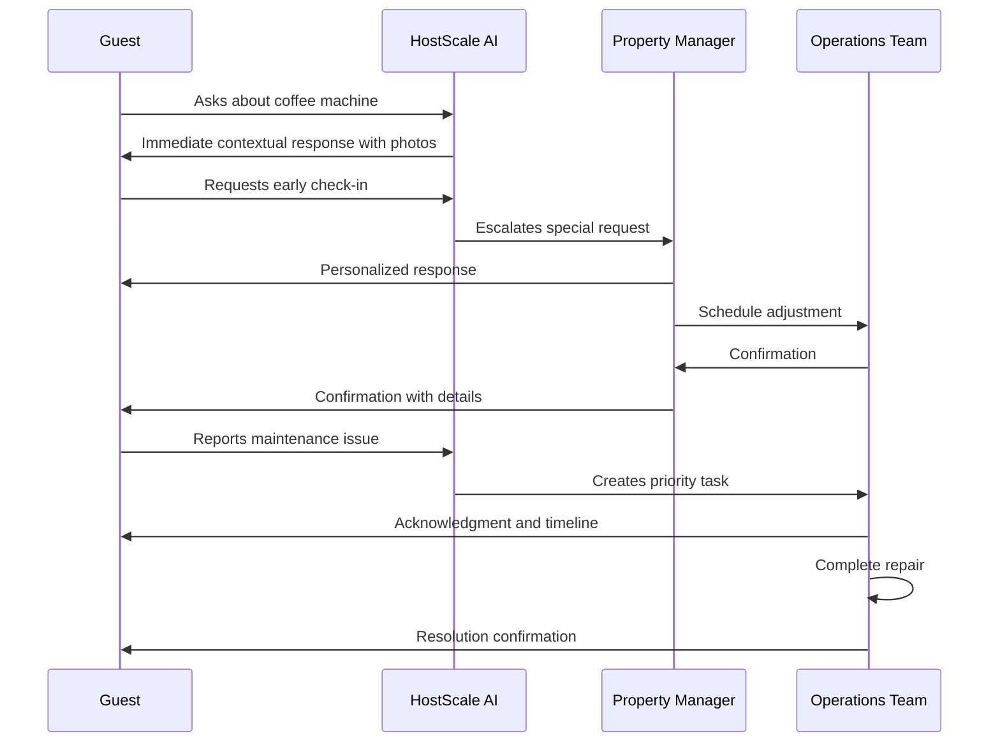

---

## Dashboard Experience Preview

Experience your entire property empire at a glance with our intuitive dashboard:

![Dashboard Preview Placeholder]

*The actual interactive dashboard will be shown during your personalized demo.*

**Key Features:**
- Real-time property status indicators
- Performance metrics across your portfolio
- Task management with priority visualization
- Guest communication hub
- Marketing performance analytics
- Team productivity tracking

---

## Implementation Options

HostScale offers flexible implementation approaches to match your needs:

### Option 1: Strategic Partnership
A comprehensive monthly subscription that includes:
- Full platform access
- Dedicated implementation support
- Ongoing optimization and strategy
- Priority feature development
- Regular business reviews

### Option 2: Standalone Solution
A one-time implementation with:
- Core platform functionality
- Google Sheets integration
- Initial setup and configuration
- Basic training and documentation
- Standard support package

Both options provide a clear path to scale from 60+ to 150+ properties with confidence.

---

## Implementation Timeline

Your journey to operational excellence:

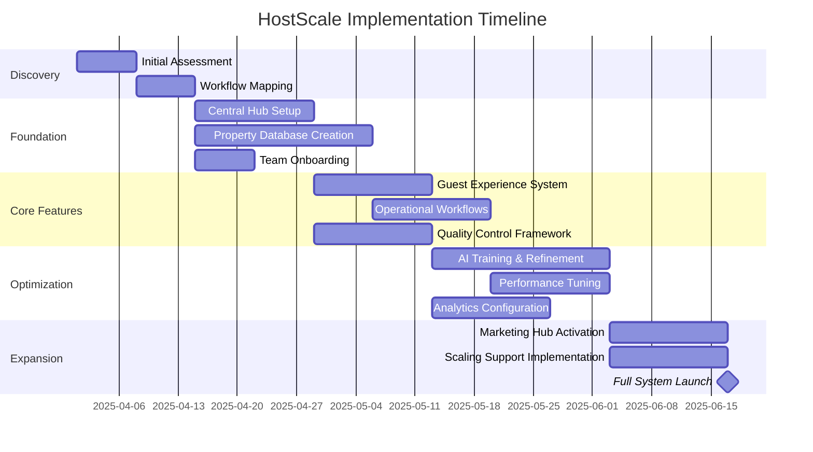

---

## Transformative Results

HostScale clients experience substantial operational improvements:

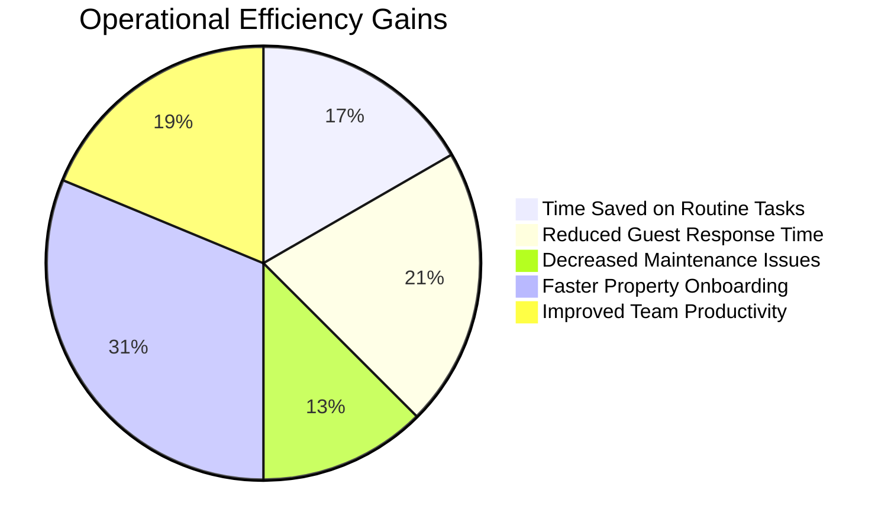

Revenue impacts are equally impressive:

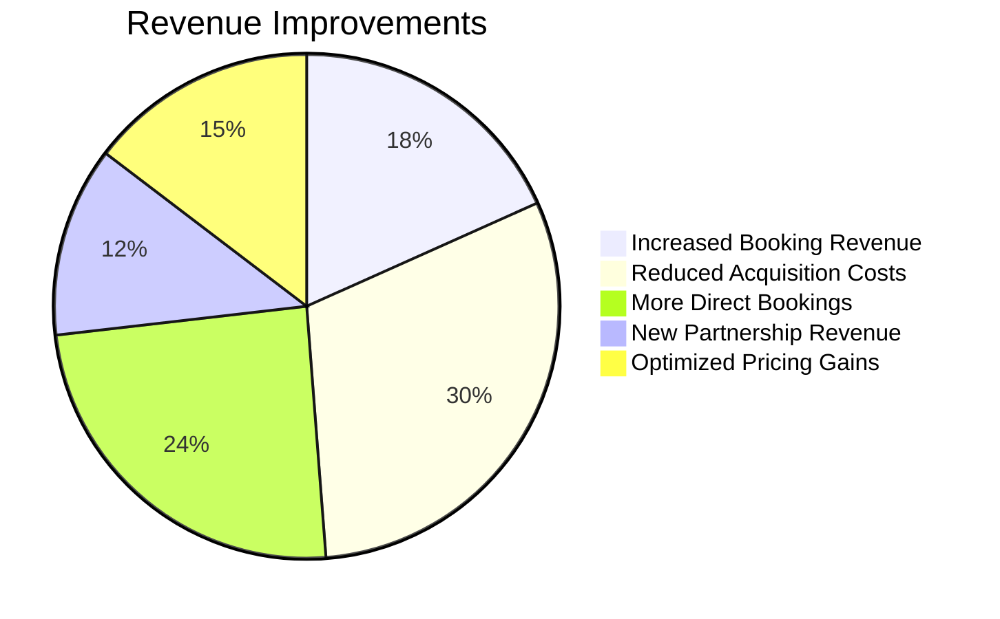

---

## Beta Program Opportunity

As one of our select beta partners, you'll receive:

- **Preferred pricing**: Special beta partner rates
- **Dedicated implementation**: Personalized onboarding and setup
- **Feature influence**: Direct input into product development
- **Priority support**: Immediate assistance when needed
- **Early access**: First to receive new features and enhancements

This limited opportunity is available for property managers ready to transform their operations and scale efficiently.

---

## Next Steps

1. **Discovery Workshop**: A 2-hour session to analyze your current operations
2. **Custom Assessment**: Detailed analysis of potential improvements and ROI
3. **Implementation Plan**: Tailored approach based on your specific needs
4. **Kickoff**: Begin your transformation to efficient, scalable operations

---

## Book Your Discovery Call

Ready to transform your property management approach? Schedule your personalized discovery call today.

[SCHEDULE NOW] <!-- This would be an interactive button in the actual landing page -->

---

*HostScale: Scale your property empire without scaling your workload.*

# HostScale Interactive Proposal Website Sections

## Overview

The HostScale interactive proposal website will break convention from traditional PDFs and presentations, creating an immersive, engaging experience that demonstrates the platform's capabilities while educating the client on our solution. Each section employs modern design elements including glassmorphism, subtle animations, and interactive components to reinforce the innovative nature of our offering.

## Navigation Structure

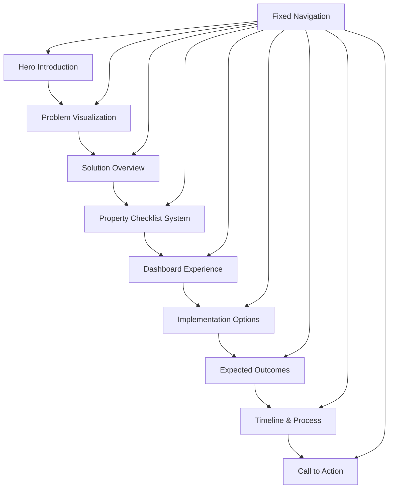

The website employs vertical scrolling as the primary navigation method with fixed-position indicators showing progress and enabling quick jumps between sections.

## Section Details

### 1. Hero Introduction

#### Visual Concept
A full-screen welcome with a deep blue-purple gradient background featuring subtle particle animations that respond to mouse movement. The HostScale logo appears with an elegant entrance animation, followed by the main value proposition appearing with a typewriter effect.

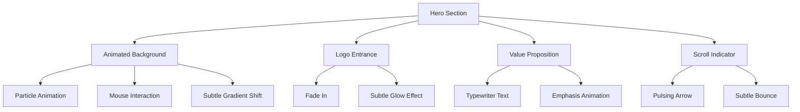

#### Content Elements
- Dynamic greeting based on time of day
- Bold headline: "Transform Your Property Empire: From 60+ to 150+"
- Subheading highlighting the unified management approach
- Subtle scroll indicator inviting deeper exploration
- Background with animated particles representing the property network

#### Interactive Elements
- Particles that respond to mouse movement, creating a sense of connection
- Scroll-triggered animations that reveal content as the user explores
- Custom cursor effect when hovering over interactive elements

### 2. Problem Visualization

#### Visual Concept
An interactive visualization depicting the current fragmented approach to property management. Disconnected islands representing different Airbnb accounts, vendor spreadsheets, and manual processes with animated paths showing inefficient workflows.

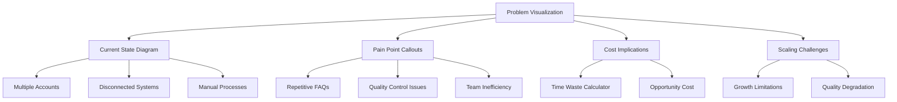

#### Content Elements
- Visual representation of disconnected systems
- Animated illustrations of common pain points:
  * Repetitive FAQ responses
  * Disconnected vendor management
  * Manual cleaning coordination
  * Fragmented guest communication
- Data visualization showing time and revenue loss

#### Interactive Elements
- Clickable pain points that expand to reveal detailed explanations
- Hover states that highlight specific challenges
- Toggle between different problem categories (Guest Experience, Operations, Scaling)
- Interactive calculator showing current inefficiency costs

### 3. Solution Overview

#### Visual Concept
A smooth transition from problems to solution, with the fragmented elements coming together into a unified, glowing central hub. Glassmorphism panels emerge showing different aspects of the solution with flowing connections between them.

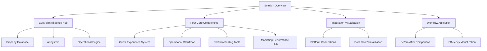

#### Content Elements
- Central Intelligence Hub visualization
- Four interconnected solution components:
  * AI-Powered Guest Experience System
  * Operational Workflow Engine
  * Portfolio Scaling Tools
  * Marketing Performance Hub
- Animated flow showing how information moves through the system

#### Interactive Elements
- Expandable solution components that reveal detailed features
- Interactive diagram showing information flow between system elements
- Clickable examples of how specific problems are solved
- Before/after comparison slider

### 4. Property Checklist System

#### Visual Concept
A stunning visualization of the comprehensive 16-category property checklist system. Categories appear as glass panels arranged in a circular pattern around a central property icon, with connections showing relationships between categories.

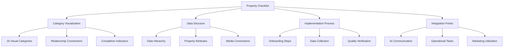

#### Content Elements
- Visual representation of all 16 checklist categories
- Sample property data implementation
- Completeness indicators showing thoroughness
- Integration points with other system components

#### Interactive Elements
- Expandable categories that reveal detailed checklist items
- Search functionality that highlights relevant checklist items across categories
- Sample exploration of how the checklist powers the AI response system
- Toggle between different property types showing checklist adaptability

### 5. Dashboard Experience

#### Visual Concept
A functional mock dashboard interface that gives the client a taste of what their actual management system will look like. Dark-themed with glassmorphism effects, featuring realistic property data and interactive elements.

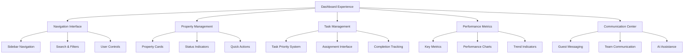

#### Content Elements
- Navigation sidebar with key management categories
- Property cards showing status and key metrics
- Task management system with priority visualization
- Guest communication preview
- Performance analytics section

#### Interactive Elements
- Clickable property cards that expand to show detailed information
- Working filters to sort and view properties by different criteria
- Interactive task management with status changes
- Simulated notifications and alerts
- Toggle between different dashboard views

### 6. Implementation Options

#### Visual Concept
A split-screen comparison of the two implementation approaches, with toggle switch in the center. Glass panels show the features, benefits, and structure of each option with visual differentiation through color accents.

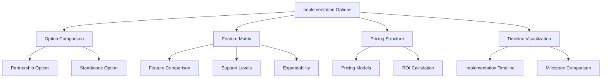

#### Content Elements
- Side-by-side comparison of Monthly Partnership vs. Standalone Dashboard
- Feature matrix highlighting differences
- Timeline visualization for each approach
- Investment overview with value proposition
- Custom tailoring options for each approach

#### Interactive Elements
- Central toggle switch to change between options
- Expandable feature descriptions
- Interactive timeline showing implementation phases
- ROI calculator that adjusts based on property count

### 7. Expected Outcomes

#### Visual Concept
Data visualization showcasing the projected impact of implementing the solution. Animated charts and metrics transition from current state to improved future state, with glass panels highlighting key improvement areas.

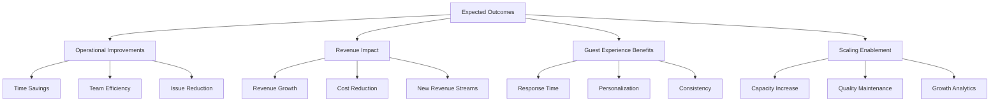

#### Content Elements
- Operational efficiency improvements (time savings, response rates)
- Guest experience enhancements (satisfaction scores, review improvements)
- Revenue growth opportunities (upselling success, occupancy rates)
- Scaling capabilities (cost per unit as portfolio grows)

#### Interactive Elements
- Animated metrics showing progressive improvements over time
- Interactive calculator for estimating specific client benefits
- Toggle between different benefit categories
- Timeline slider showing short, medium and long-term impacts

### 8. Implementation Timeline & Process

#### Visual Concept
An interactive timeline visualization showing the implementation journey from discovery to full deployment. Milestones appear as illuminated nodes on a flowing path, with phases distinguished by subtle color shifts.

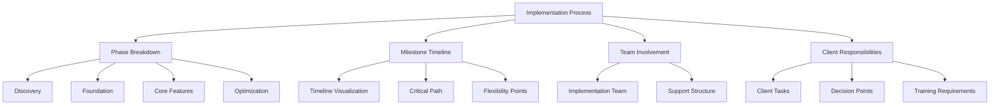

#### Content Elements
- Phased implementation approach with timeframes
- Key milestones and deliverables
- Team structure and responsibilities
- Client involvement requirements
- Training and onboarding process

#### Interactive Elements
- Expandable phases showing detailed activities
- Interactive Gantt chart visualization
- Team structure exploration
- Milestone completion simulation

### 9. Call to Action

#### Visual Concept
A bold, attention-grabbing final section with a prominent glass-effect card containing the primary call to action. Background animation creates a sense of momentum and opportunity.

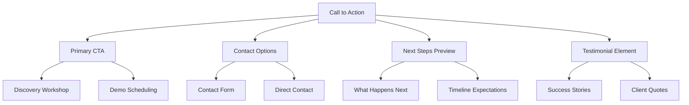

#### Content Elements
- Clear, compelling call to action: "Transform Your Property Management"
- Benefits summary reinforcing key value propositions
- Options for next steps (schedule discovery, request more information)
- Preview of what happens after engagement
- Reinforcement of beta program opportunity

#### Interactive Elements
- Interactive calendar for scheduling the discovery workshop
- Quick response form for questions
- Animated button effects
- Confetti or celebration effect upon form submission

## Interactive Navigation Elements

### Progress Indicator
A fixed-position indicator showing current position within the proposal, with the ability to jump to any section.

### Exploration Guide
Subtle visual cues that lead the user to interactive elements throughout the proposal.

### Persistent Contact
A non-intrusive but easily accessible way to reach out with questions at any point in the proposal journey.

## Technical Considerations

### Responsive Design
While optimized for desktop viewing, the proposal will be accessible and functional on tablets and mobile devices.

### Performance Optimization
Careful attention to loading times and performance to ensure smooth animations and transitions.

### Analytics Integration
Tracking of user engagement to understand which sections resonate most and inform follow-up discussions.

### Accessibility
Ensuring the interactive elements are accessible to users with disabilities, with appropriate alt text and keyboard navigation.

## Visual Design Principles

### Consistent Branding
HostScale branding elements used consistently throughout, establishing the product identity.

### Visual Hierarchy
Clear visual hierarchy guiding attention to key information and calls to action.

### Purposeful Animation
Animations that enhance understanding rather than distract, with meaning and purpose behind movements.

### Emotional Design
Design elements that evoke feelings of efficiency, control, and sophistication—emotions aligned with the value proposition.

---

This interactive proposal website will provide a memorable, engaging experience that effectively communicates the HostScale solution while demonstrating technological sophistication. By breaking from traditional formats, we position HostScale as an innovative solution from the very first interaction.