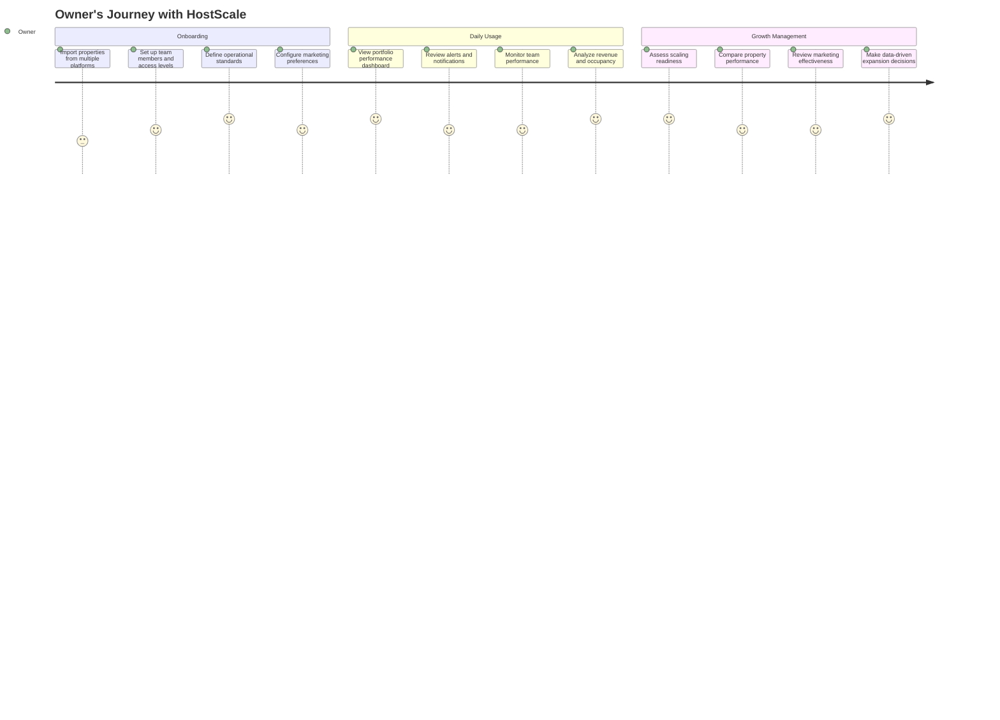
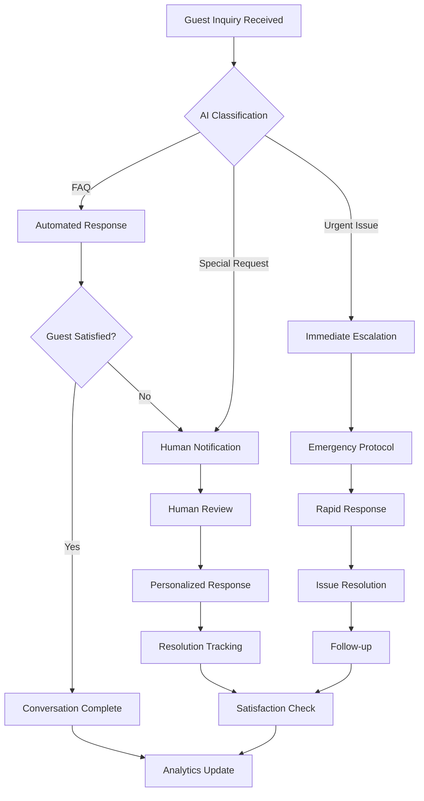
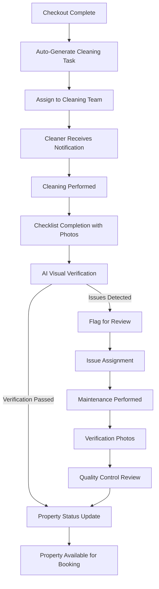
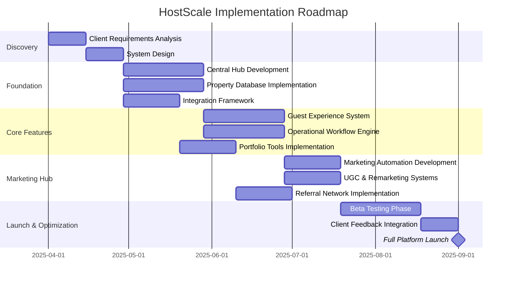

# HostScale Product Requirements Document (PRD)

## 1. Product Overview

### 1.1 Vision Statement
HostScale is an intelligent property portfolio management platform designed to help short-term rental operators scale from dozens to hundreds of properties without proportionally increasing operational complexity or sacrificing guest experience quality.

### 1.2 Target Market
- Property managers with 10+ short-term rental units
- Vacation rental management companies
- Airbnb management services
- Real estate investors with multiple rental properties

### 1.3 Key Differentiators
- AI-first approach with a comprehensive property data model
- Centralized operations with multi-platform integration
- Integrated marketing performance and guest experience systems
- Focus on scaling efficiency and quality maintenance
- Vision-based verification for property maintenance

## 2. User Personas

### 2.1 Property Portfolio Owner
**Name:** Alex Chen  
**Role:** Owner of a growing property management business  
**Properties:** Currently manages 60+ units, plans to reach 150+  
**Pain Points:**
- Managing multiple Airbnb accounts
- Inconsistent guest communication
- Difficulty maintaining quality across properties
- Rising customer acquisition costs
- Challenges with scaling operations

### 2.2 Operations Manager
**Name:** Jamie Rodriguez  
**Role:** Operations Manager overseeing daily property management  
**Key Responsibilities:**
- Coordinating cleaning and maintenance teams
- Ensuring property readiness for guests
- Managing vendor relationships
- Handling emergency situations
- Maintaining quality standards

### 2.3 Guest Experience Specialist
**Name:** Taylor Kim  
**Role:** Guest communications and experience management  
**Key Responsibilities:**
- Responding to guest inquiries
- Providing local recommendations
- Handling special requests
- Managing reviews and feedback
- Ensuring guest satisfaction

### 2.4 Marketing Director
**Name:** Morgan Shah  
**Role:** Marketing and revenue optimization  
**Key Responsibilities:**
- Managing OTA listings
- Optimizing pricing strategy
- Running marketing campaigns
- Tracking performance metrics
- Maximizing property revenue

## 3. Product Architecture

```mermaid
graph TD
    A[HostScale Platform] --> B[Central Intelligence Hub]
    A --> C[Guest Experience System]
    A --> D[Operational Workflow Engine]
    A --> E[Portfolio Scaling Tools]
    A --> F[Marketing Performance Hub]
    
    B --> B1[Property Database]
    B --> B2[Analytics Dashboard]
    B --> B3[Integration Layer]
    B --> B4[User Management]
    
    C --> C1[AI Response System]
    C --> C2[Guest Profiling]
    C --> C3[Local Recommendations]
    C --> C4[Escalation Management]
    
    D --> D1[Task Assignment]
    D --> D2[Vendor Management]
    D --> D3[Quality Control]
    D --> D4[Inventory Management]
    
    E --> E1[Onboarding Templates]
    E --> E2[Performance Benchmarking]
    E --> E3[Standardization Tools]
    E --> E4[Growth Analytics]
    
    F --> F1[Marketing Automation]
    F --> F2[UGC Generation]
    F --> F3[Remarketing System]
    F --> F4[Referral Network]
    F --> F5[CPA Optimization]
```

## 4. Core Functionality

### 4.1 Central Intelligence Hub

#### 4.1.1 Unified Dashboard
- **Requirements:**
  - Single-view access to all properties across platforms
  - Customizable widgets and information displays
  - Role-based access and views
  - Real-time status and performance indicators
  - Alert notification system

#### 4.1.2 Property Master Database
- **Requirements:**
  - 16-category property checklist system
  - Structured data for all property details
  - Media library for property photos and documents
  - Vendor and service provider associations
  - Historical record of changes and updates

#### 4.1.3 Analytics Engine
- **Requirements:**
  - Real-time performance metrics
  - Historical trends and pattern recognition
  - Comparative analysis across properties
  - Custom report generation
  - Predictive analytics for occupancy and revenue

#### 4.1.4 Integration Layer
- **Requirements:**
  - Bidirectional sync with all major OTAs (Airbnb, VRBO, Booking.com)
  - Calendar synchronization
  - Pricing integration
  - Review management integration
  - API access for custom integrations

### 4.2 AI-Powered Guest Experience

#### 4.2.1 Intelligent Response System
- **Requirements:**
  - Natural language processing for guest inquiries
  - Contextual awareness of property details
  - Personalized response generation
  - Multi-language support
  - Conversation history tracking

#### 4.2.2 Smart Escalation Framework
- **Requirements:**
  - Criticality assessment of guest needs
  - Automatic routing to appropriate team members
  - Escalation triggers and timeframe monitoring
  - Response time tracking and alerts
  - Resolution verification

#### 4.2.3 Guest Preference Engine
- **Requirements:**
  - Guest profile development over time
  - Preference tracking across stays
  - Personalized recommendations
  - Special occasion recognition
  - Return guest identification and VIP treatment

### 4.3 Operational Workflow Automation

#### 4.3.1 Task Management System
- **Requirements:**
  - Automated task generation based on bookings
  - Priority-based task organization
  - Assignment to appropriate team members/vendors
  - Real-time status tracking
  - Completion verification with photo evidence

#### 4.3.2 Quality Control Framework
- **Requirements:**
  - Digital checklists for all operational activities
  - Vision-based verification of cleaning and maintenance
  - Historical quality tracking by property
  - Issue identification and resolution tracking
  - Performance metrics for service providers

#### 4.3.3 Vendor Management
- **Requirements:**
  - Vendor database with service categories
  - Performance tracking and rating system
  - Automated work order generation
  - Payment tracking and processing
  - Communication logging

### 4.4 Portfolio Scaling Tools

#### 4.4.1 Property Onboarding System
- **Requirements:**
  - Step-by-step new property integration workflow
  - Template-based setup for consistent configuration
  - Bulk import capabilities for multiple properties
  - Checklist verification for completeness
  - Launch readiness assessment

#### 4.4.2 Resource Optimization
- **Requirements:**
  - Staff allocation recommendations
  - Service territory mapping and optimization
  - Inventory and supply management across properties
  - Cost efficiency analysis
  - Scaling readiness assessment

### 4.5 Marketing Performance Hub

#### 4.5.1 Marketing Automation Engine
- **Requirements:**
  - Guest journey orchestration (pre, during, post-stay)
  - Triggered communications based on guest behavior
  - Dynamic content personalization
  - A/B testing framework
  - Performance tracking and optimization

#### 4.5.2 UGC Generation System
- **Requirements:**
  - Property-specific photo opportunity guides
  - Guest content request automation
  - Rights management and permission tracking
  - Content performance analytics
  - Multi-channel content deployment

#### 4.5.3 Remarketing Audience Builder
- **Requirements:**
  - Guest segmentation based on stay patterns
  - Integration with major ad platforms
  - Automated audience refreshing
  - Behavioral targeting parameters
  - Performance tracking by audience segment

#### 4.5.4 Referral & Affiliate Network
- **Requirements:**
  - Guest referral program with tracking
  - Local business partnership management
  - Commission calculation and tracking
  - Affiliate portal for partners
  - Performance analytics by referral source

## 5. User Journeys

### 5.1 Property Portfolio Owner Journey

### 5.2 Guest Experience Workflow

### 5.3 Property Maintenance Workflow

## 6. Technical Requirements

### 6.1 Platform Architecture
- Cloud-based SaaS application
- Microservices architecture
- RESTful API for integrations
- Real-time data processing
- Scalable infrastructure

### 6.2 Data Security
- End-to-end encryption
- Role-based access control
- GDPR and privacy law compliance
- Regular security audits
- Secure authentication system

### 6.3 Performance Requirements
- 99.9% uptime guarantee
- Response time under 2 seconds
- Support for concurrent users
- Data backup and disaster recovery
- Handling high transaction volumes

### 6.4 Integration Requirements
- API documentation for partners
- Webhook support for events
- OAuth authentication for third-parties
- Bulk data import/export capabilities
- Mobile app integration

## 7. Implementation Roadmap

## 8. Success Metrics

### 8.1 Operational Metrics
- 40% reduction in time spent on routine tasks
- 50% faster response to guest inquiries
- 30% reduction in maintenance issues
- 90% automation of check-in/check-out processes
- 25% improvement in cleaning team efficiency

### 8.2 Financial Metrics
- 15% increase in overall booking revenue
- 25% reduction in customer acquisition costs
- 20% increase in direct bookings
- 30% reduction in operational costs per property
- Positive ROI within 6 months of implementation

### 8.3 Scaling Metrics
- Ability to increase property portfolio 2.5x without proportional staffing increase
- Maintain or improve guest satisfaction while scaling
- Consistent quality scores across all properties
- 75% reduction in new property onboarding time
- 90% standardization of processes across portfolio

## 9. Beta Testing Plan

### 9.1 Beta Participant Requirements
- Currently managing 20+ properties
- Using multiple OTA platforms
- Diverse property types
- Growth-oriented business
- Willing to provide regular feedback

### 9.2 Beta Program Structure
- Duration: 90 days
- Phased feature rollout
- Weekly feedback sessions
- Performance benchmarking
- Priority support and training
- Pre and post-implementation metrics comparison

### 9.3 Success Criteria for Beta Program
- All core functionality implemented and tested
- Clear metrics showing improvements over baseline
- User feedback incorporated into final product
- Technical stability with minimal issues
- Client satisfaction and testimonial
- Clear path to full commercial launch

## 10. Pricing & Commercialization

### 10.1 Pricing Structure
- Tiered subscription model based on property count
- Feature-based tier differentiation
- Volume discounts for larger portfolios
- Implementation and training packages
- Optional premium support tiers

### 10.2 Go-to-Market Strategy
- Initial beta with 3-5 strategic clients
- Targeted marketing to property management companies
- Industry conference showcases
- Partner channel development
- Content marketing focused on scaling challenges

### 10.3 Growth Projections
- Year 1: 50 clients with average 30 properties each
- Year 2: 150 clients with average 40 properties each
- Year 3: 350 clients with average 45 properties each
- 30% annual growth in features and capabilities
- Expansion into additional market segments

---

**Document Owner:** Product Management Team  
**Last Updated:** March 30, 2025  
**Version:** 1.0